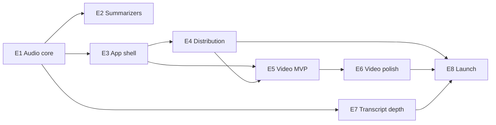

# Meeting Companion — Backlog

Epics and stories sequenced into milestones. Each story has acceptance criteria (AC) written to be executable without further product discussion. Cross-references: [PRD.md](PRD.md) (requirement IDs like A1, C5) and [TECH_PLAN.md](TECH_PLAN.md) (architecture decisions like TD-1).

**Milestones**

- **M1 — Standalone audio core:** the existing recorder works with zero external dependencies on a clean Mac.
- **M2 — Shippable app:** installer, updates, onboarding, settings, brand. A stranger can download and succeed.
- **M3 — Video companion MVP:** virtual camera with blur, backgrounds, overlays, standby card.
- **M4 — Product polish & differentiation:** diarization, playback, presets, templates, performance hardening.
- **M5 — Launch:** website, licensing, metrics, beta program.

Sizing: S (≤½ day), M (≤2 days), L (≤1 week), XL (needs breakdown before starting).

---

## Epic E1 — Zero-dependency audio core (M1) — PRD A1, A2, A5

**Goal:** delete `ToolResolver`'s Homebrew assumptions entirely: no ffmpeg, no whisper-cli, no claude CLI.

- **E1.1 (L) Replace ffmpeg mixing with AVFoundation.** Mix `system.wav` + `mic.wav` to 16 kHz mono via AVAudioEngine offline rendering / AVAudioConverter in `Mixer.swift`.
  AC: byte-identical-length output vs. current path on a 3-test-file suite (silence, speech both channels, mismatched durations — `duration=longest` semantics preserved); ffmpeg no longer referenced anywhere; unit test with fixture WAVs.
- **E1.2 (L) Embed WhisperKit as the transcription engine.** SwiftPM dep (argmax-oss-swift, MIT); new `TranscriptionEngine` protocol with `WhisperKitEngine` implementation returning the existing `TranscribedSegment` shape.
  AC: transcribing the sample WAV in `spike-audio/output/` yields segments with timestamps within ±500 ms of current whisper-cli output; `whisper-cli`/`ToolResolver` path deleted; engine runs on ANE/GPU (verify no CPU-only fallback on M-series).
- **E1.3 (L) In-app model manager.** Download/verify/store Whisper models under Application Support; progress UI, resume after network drop, checksum validation, delete/redownload; default model `large-v3-turbo` quantized (~600 MB class) with picker for small/medium/large.
  AC: fresh machine → first transcription possible with no Terminal use; kill app mid-download → relaunch resumes; corrupt file → detected and re-fetched; storage shown in Settings.
- **E1.4 (M) SpeechAnalyzer engine (macOS 26+).** Second `TranscriptionEngine` using Apple's SpeechAnalyzer/SpeechTranscriber; auto-offered on supported OS as "Apple (no download)".
  AC: engine selectable in Settings; produces segments in the same schema; gated cleanly at runtime on older macOS.
- **E1.5 (M) Crash-safe recording & recovery.** Detect orphaned `status=recording` rows at launch; offer recovery (finalize files, run pipeline) or discard. Disk preflight: refuse start under 2 GB free; warn mid-recording under 1 GB.
  AC: `kill -9` during recording → relaunch shows recovery prompt → transcript produced from partial audio; simulated low disk triggers warning toast.
- **E1.6 (S) Remove `claude` CLI dependency stub.** Summarizer routes through the E2 provider layer; when no provider configured, pipeline completes with transcript-only and the meeting shows "Add a summarizer" call-to-action instead of `failed`.
  AC: clean Mac with zero config: record → mix → transcribe → `ready` (no summary), no errors.

## Epic E2 — Summarization provider layer (M1–M2) — PRD B1–B3

- **E2.1 (M) `SummaryProvider` protocol + registry.** Backends enumerated, capability-probed (availability, needs-key, privacy label), user default + per-meeting override; provider recorded on each `SummaryRow` (schema migration: add `provider`, `template`).
  AC: switching providers requires no restart; each summary row knows which provider/template produced it.
- **E2.2 (M) Apple Foundation Models provider (macOS 26+, default).**
  AC: on a macOS 26 Apple-Silicon machine with Apple Intelligence enabled, summaries generate with zero configuration; graceful capability messaging otherwise (model not ready, AI disabled).
- **E2.3 (M) BYOK providers: Anthropic + OpenAI.** Keys in Keychain (never UserDefaults/plaintext); model picker with sane defaults (claude-sonnet-5 / gpt current-gen); streaming not required (batch is fine); token-limit handling via transcript chunking + reduce step for >100k-token meetings.
  AC: invalid key → clear inline error at save time (live validation call); transcript of a 2-hr meeting summarizes without overflow; Settings shows an explicit "sent to Anthropic/OpenAI" privacy label.
- **E2.4 (S) Local-server provider (Ollama / LM Studio).** OpenAI-compatible base-URL + model name fields.
  AC: works against a local Ollama running llama3.2; connection-test button.
- **E2.5 (M) Summary templates.** Built-ins: General (current prompt), 1:1, Standup, Sales call, Interview; template = system prompt + section schema; custom template editor (name + prompt).
  AC: per-meeting template picker; regenerate with a different template replaces summary (history kept: keep last 3 generations).
- **E2.6 (S) Quick actions.** "Regenerate", "Shorter", "As follow-up email" on the summary tab; email variant opens in a copyable sheet.
  AC: each action produces new output in <30 s with the configured provider and does not clobber generation history.

## Epic E3 — App shell, identity & onboarding (M2) — PRD D1, D3, D4, §6

- **E3.1 (L) Migrate SwiftPM executable → Xcode app project.** Proper bundle, Info.plist, entitlements, asset catalog, icon; SwiftPM package retained for the core as a local package (`MeetingCore`) so logic stays testable. (Required for system-extension embedding — TD-4.)
  AC: `xcodebuild` produces a signed .app; existing functionality unchanged; core logic importable by unit tests and by the future extension target.
- **E3.2 (L) Unified main window.** Sidebar (Meetings + search, Camera, Settings shortcut) replacing separate Library window; meeting detail keeps Summary/Notes/Transcript tabs.
  AC: old Library/Detail features (search, rename, delete, export) all reachable in new window; menu bar "Open Library" → opens main window at Meetings.
- **E3.3 (L) Onboarding flow rewrite.** Multi-step: welcome → mic → screen recording (with animated guidance for the Settings toggle) → calendar (skippable) → model download (progress inline) → test recording moment (10-s scripted capture → live pipeline → summary reveal) → camera extension step added in M3.
  AC: fresh macOS VM: a first-time user reaches a real summary without leaving the flow; every permission has a "later" path; re-runnable from Settings.
- **E3.4 (M) Settings window.** Tabs per PRD D4; includes retention controls (A7: keep audio forever/30d/delete-after-transcribe) and storage usage.
  AC: all existing UserDefaults knobs (auto-record mode, model path override) surfaced; retention sweep runs daily and honors per-meeting pins.
- **E3.5 (M) Brand pass.** Name (PRD §8 decision), icon, accent, menu-bar iconography, empty states, About window.
  AC: no placeholder strings ("MeetingNotes") anywhere; consistent name in bundle ID migration story (keep old Application Support path via one-time migration).

## Epic E4 — Distribution & updates (M2) — PRD D2

- **E4.1 (M) Signing & notarization pipeline.** Developer ID cert, hardened runtime, entitlements audit; script `Scripts/release.sh`: archive → notarize (`notarytool`) → staple.
  AC: Gatekeeper-clean launch on a fresh Mac (no right-click-open dance).
- **E4.2 (M) DMG installer.** create-dmg layout (app + /Applications symlink + background art); the DMG nudges "move to /Applications" (required for the camera extension later).
  AC: DMG opens styled; app launched from DMG detects it's not in /Applications and offers to move itself.
- **E4.3 (M) Sparkle 2 auto-updates.** Appcast hosting (S3/GitHub Releases), EdDSA signing, release-notes surface, staged rollout flag.
  AC: v-current updates to v-next in-place including while a recording is NOT in progress (updates deferred during recording).
- **E4.4 (S) Crash & diagnostics opt-in.** Local log file (OSLog + export bundle), optional crash reporting (Sentry or roll-our-own breadcrumbs), "Export diagnostics" in Help.
  AC: user can produce a zip for support containing logs but zero meeting content.

## Epic E5 — Video companion MVP (M3) — PRD C1–C5, TD-4/5/6

- **E5.1 (XL→break down at start) CMIO Camera Extension skeleton.** System-extension target embedded in the app; "Companion Camera" appears as a device system-wide; app↔extension frame transport via the extension's sink stream; activation/deactivation UX with OSSystemExtensionRequest, including the System Settings approval walkthrough.
  AC: extension installs from the signed app in /Applications; camera selectable in Photo Booth, Zoom, Chrome (Meet), Safari; shows branded placeholder frames when app isn't streaming; uninstall path removes it cleanly.
- **E5.2 (L) Capture & render pipeline.** AVCaptureSession (device picker incl. iPhone Continuity Camera) → CVPixelBuffer pipeline on Metal; passthrough mode ≤5 ms added latency; in-app live preview panel.
  AC: 1080p30 sustained 30 min with zero dropped frames in passthrough on M1; camera hot-swap without restart.
- **E5.3 (L) Person segmentation + background treatments.** Vision `VNGeneratePersonSegmentationRequest` (quality tiers) with temporal smoothing at mask edges; blur (variable radius), image replacement, color wash.
  AC: C8 perf budget met at 1080p30/balanced on M1 (instrument and record numbers); no halo/flicker on the standard test clip; quality auto-degrades under thermal pressure with a subtle UI indicator.
- **E5.4 (M) Overlay engine.** Core Image/Metal compositor for logo (PNG w/ alpha), lower-third (name/title), free text; drag-to-place in preview with safe-area guides and snapping; overlay set persisted per preset.
  AC: text is crisp at 1080p (rendered at stream resolution, not scaled); layout survives resolution changes.
- **E5.5 (M) Standby cards.** Card designer (background + logo + primary/secondary text) with 3 shipped variants (BRB, Listening, Intro); hotkey + menu-bar + notes-panel toggles; auto-return countdown option.
  AC: toggling card ↔ live takes <200 ms; hotkey works while any app is frontmost (global, remappable).
- **E5.6 (M) Camera onboarding step + first-run demo.** Added to E3.3 flow: enable extension → approve → preview yourself → try the standby card.
  AC: measured flow completion; failure states (user denies approval) leave app fully functional with camera features marked "needs approval".

## Epic E6 — Video polish (M4) — PRD C6, C7

- **E6.1 (M) Presets/scenes.** Named bundles (background + overlays + card); menu-bar switcher; ⌘1–9 hotkeys.
- **E6.2 (M) Calendar-aware auto-preset.** Rule: external-attendee meetings → chosen preset; internal → another. AC: rule editor with attendee-domain matching; never switches mid-meeting without a 3-s undo toast.
- **E6.3 (M) Enhance pass.** Auto-framing crop (Vision face/person tracking, smoothed), exposure/white-balance touch-up, mirror toggle.
- **E6.4 (S) Watermark & Pro gating** per PRD §7 once licensing (E8.2) exists.

## Epic E7 — Transcript & library depth (M4) — PRD A3, A6, B4, B5

- **E7.1 (L) Speaker diarization.** SpeakerKit (or evaluated equivalent) post-pass assigning speaker IDs to segments (schema: `speaker` column); rename speakers in transcript UI; optional auto-suggest names from calendar attendees.
  AC: 2-person 30-min test call: ≥90% of segments correctly attributed after renaming; diarization adds <25% to pipeline wall-time.
- **E7.2 (L) Audio playback synced to transcript.** Player bar in detail view; click segment → seek; playhead highlights current segment; 1.5×/2× speeds.
  AC: seek accuracy within one segment; works for recovered/partial recordings.
- **E7.3 (M) Action-item follow-through.** Checkboxes on parsed action items; export selected to Apple Reminders; ICS snippet for follow-up meeting.
- **E7.4 (M) Library organization.** Tags, favorites, date filters; FTS search extended with speaker filter.
- **E7.5 (L, post-v1 flag) Ask-your-meetings chat.** Local embedding index + provider-backed chat over selected meeting(s). Explicitly out of v1 scope; story exists to keep schema decisions (embedding table) from being blocked later.

## Epic E8 — Launch (M5) — PRD D5, D6, §7

- **E8.1 (M) Privacy page + data-flow diagram** (in-app + web); third-party license attribution screen (WhisperKit MIT, GRDB MIT, Sparkle MIT — and confirm no GPL code from webcamoid was copied).
- **E8.2 (L) Licensing/paywall.** Paddle or Lemon Squeezy checkout, license activation UI, offline grace, Free-tier limits per PRD §7.
- **E8.3 (M) Website** with 90-s hero video (standby-card save + summary reveal), docs, changelog feed from appcast.
- **E8.4 (M) Beta program.** 20–50 users via TestFlight-external-equivalent (Sparkle beta channel); feedback form in Help menu; success metrics instrumentation (local, aggregate, opt-in — PRD §9).
- **E8.5 (S) Name/trademark/domain check** (unblocks E3.5 finalization).

---

## Sequencing & dependency notes

- E1 and E2 can proceed in parallel immediately; both are pure-Swift work inside the existing codebase.
- E3.1 (Xcode migration) should land **before** heavy UI work and is a hard prerequisite for E5.1 (extension embedding) and E4.1 (signing).
- E5.1 needs a paid Apple Developer account with the System Extension entitlement — request early, approval latency is a schedule risk.
- The single riskiest story is E5.1; prototype it the same week M2 starts (tracer bullet), not at M3 kickoff.
